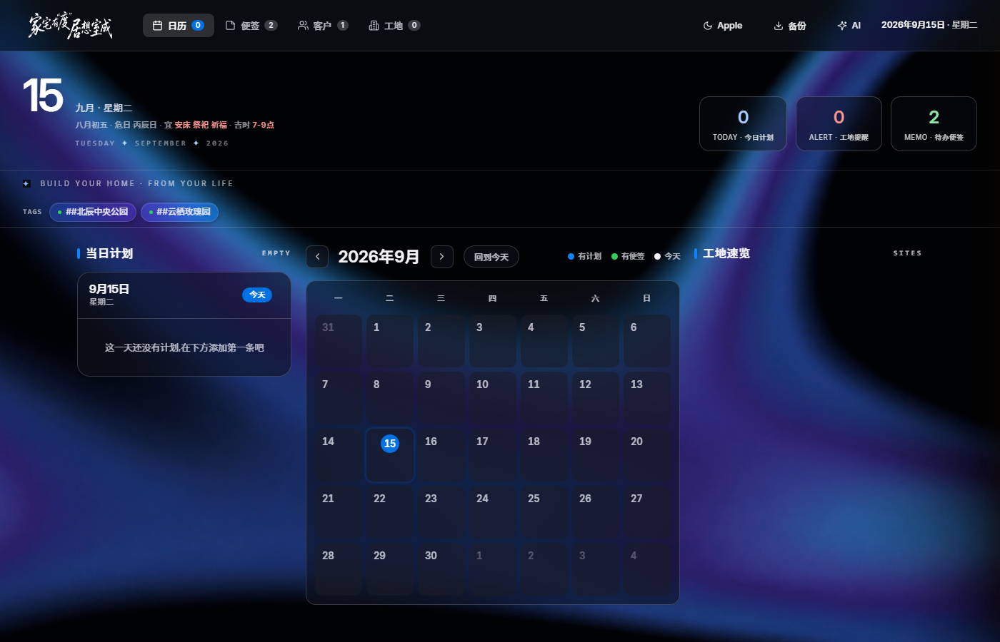
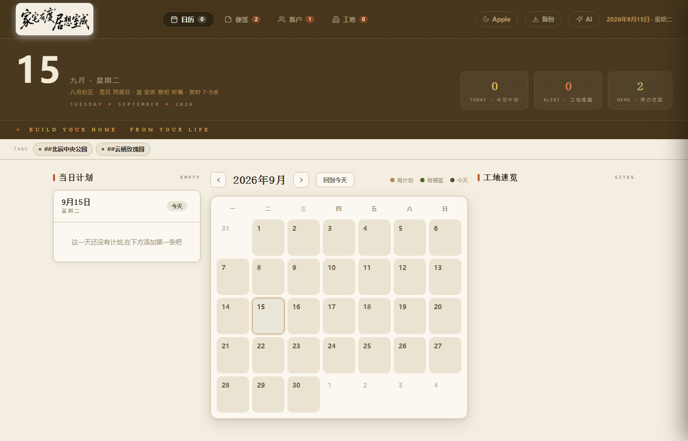
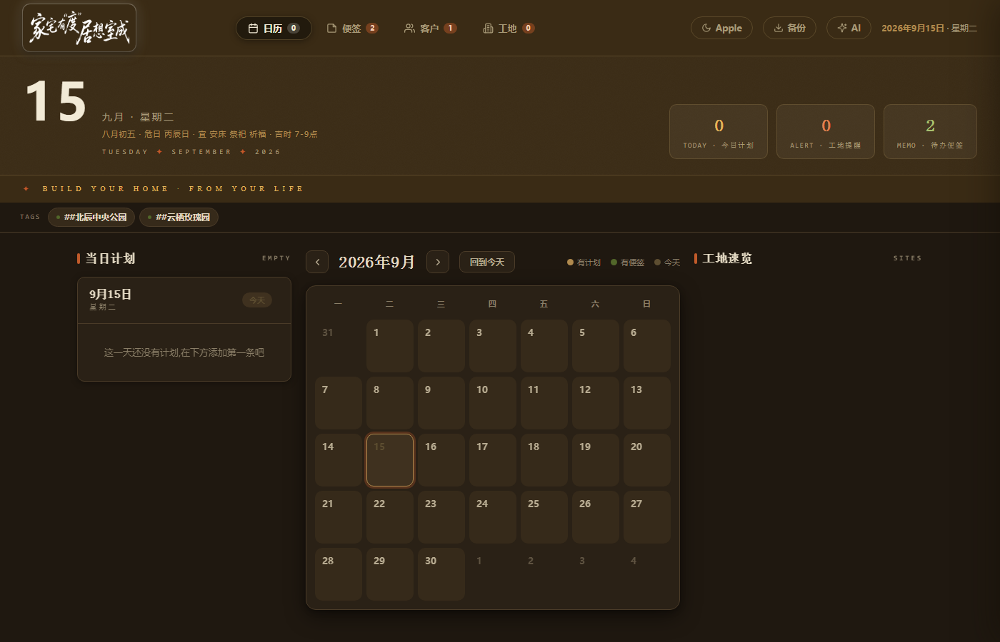
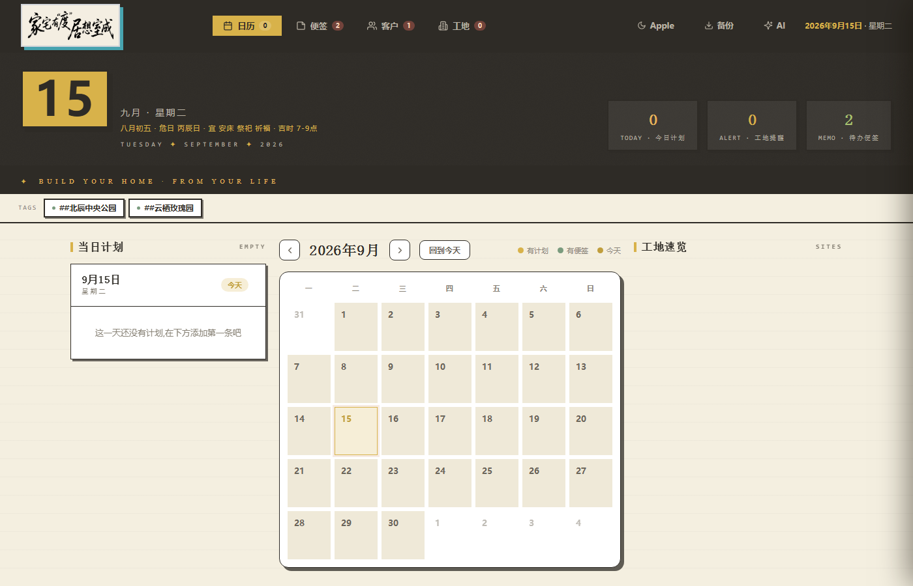
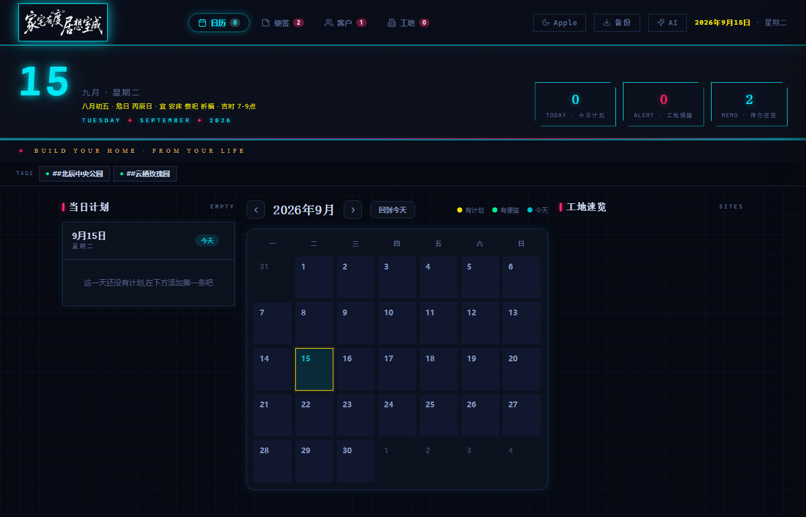

# LUSEM 个人工作站

> 日历 · 便签 · 客户 · 工地 — 室内设计师的一站式桌面工作台

单文件 HTML 应用，数据存浏览器 localStorage，零依赖、离线可用。

## 预览

### Apple · 玻璃白（默认主题）

### 浅色

### 深色

### 粗野主义

### 赛博朋克

## 功能

- **日历**：当日计划管理、工地提醒、跨阶段预警、农历黄历
- **便签**：瀑布流双列、多内容块、标签关联工地、AI 预判注意事项
- **客户**：楼盘/风格标签、跟进进度、关联便签与日历记录、一键转签约
- **工地**：施工/设计双体系、阶段进度追踪、全局标签
- **AI**：DeepSeek 驱动，便签预判冲突、计划识别标签
- **备份**：JSON 导入导出、自动备份、图片压缩

## 使用

直接双击 `LUSEM的个人工作站.html` 即可打开，无需安装任何依赖。

## 技术

- 纯 HTML + CSS + JavaScript，单文件 ~1.2MB（含内嵌视频背景）
- CSS 变量驱动的 5 套主题，一键切换
- localStorage 持久化，数据仅存本地

---

*Design by LUSEM · Built with Hermes Agent*
